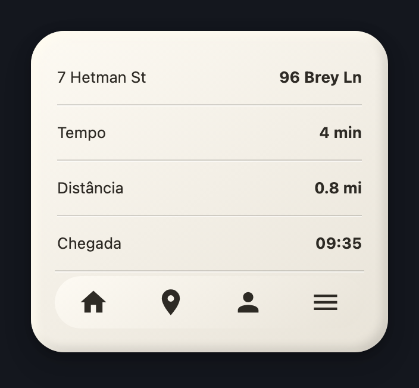
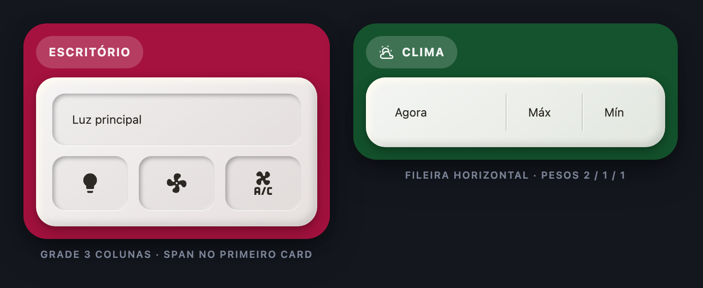
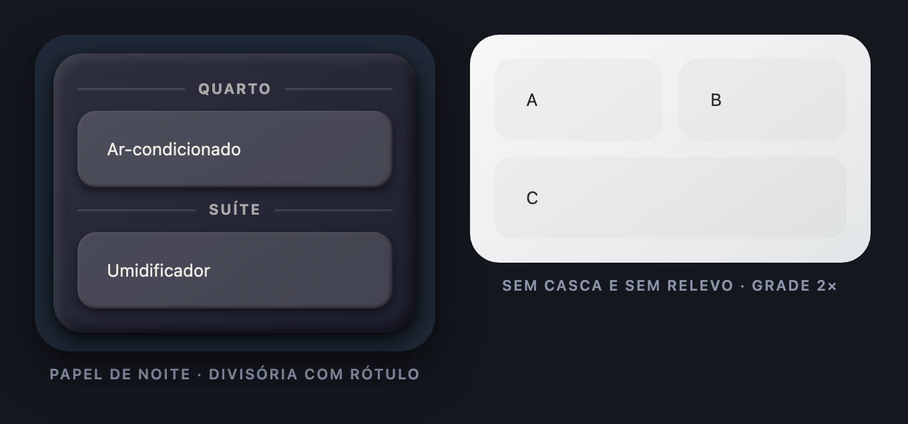

<!-- MW-BRAND:BEGIN — gerado por IA/tools/mw-brand.sh · não editar à mão -->
<p align="center">
  <a href="https://github.com/visaodeempresa">
    
  </a>
  <br>
  <sub><b>Visão de Empresa</b> · componente de Home Assistant por MAYCON WILLIAN OLIVEIRA</sub>
</p>
<!-- MW-BRAND:END -->

# MW Paper Panel Card

Um painel de **papel encardido com relevo 3D** que guarda **outros cards do
Home Assistant** dentro dele — botões, `picture-elements`, gráficos, o que for.
Os cards de dentro se arranjam em **pilha**, **fileira** ou **grade**, cada um
podendo ocupar mais de uma coluna ou linha, e o painel desenha **linhas
divisórias** de papel entre eles.

<p align="center"></p>

- **Hospeda qualquer card** — o que o Lovelace cria, este painel guarda.
- **Três arranjos** — pilha vertical, fileira horizontal, grade de N colunas.
- **Span por card** — `grid_options: {columns, rows}`, a mesma gramática do
  `custom-stack-cards`.
- **Divisórias** — automáticas entre todos os cards, ou colocadas uma a uma,
  com rótulo no meio da linha.
- **Papel 3D** — as 49 cores de papel da casa, rampa clara e rampa de noite,
  com o relevo do **MW Power Button**.
- **A peça afunda ou sobe** — o card de dentro pode ficar gravado no papel ou
  saliente sobre ele.
- **Editor visual rico** — lista de cards com mover/duplicar/apagar, o
  seletor de cards do próprio HA, campos de span por item e todos os
  controles de aparência.

## Instalação (HACS)

1. HACS → ⋮ → **Custom repositories**
2. Repositório: `https://github.com/visaodeempresa/mw-ha-paper-panel-card` · Categoria: **Dashboard**
3. **Download** e recarregue a página (Ctrl/Cmd + Shift + R).

Instalação manual: copie `dist/mw-paper-panel-card.js` para
`/config/www/` e adicione o recurso
`/local/mw-paper-panel-card.js` como **JavaScript Module**.

## Exemplos

Cada exemplo abaixo é uma variação da bancada (`tools/preview.html`) — a mesma
que gera as fotos, então foto e YAML nunca discordam. O arquivo completo de
cada um está em [`examples/`](examples/).

### Pilha vertical com divisórias — [`examples/rota.yaml`](examples/rota.yaml)


Sem casca colorida: o próprio papel é o card. `separators: between` põe um fio
entre cada dois cards, e o rodapé de ícones é um **segundo painel aninhado**,
em fileira e sem relevo.

```yaml
type: custom:mw-paper-panel-card
shell: false
panel_radius: 28
content_padding: 20
gap: 4
separators: between
separator_inset: 2
cards:
  - type: markdown
    content: "**7 Hetman St** → **96 Brey Ln**"
  - type: entity
    entity: sensor.rota_tempo
    name: Tempo
  - type: entity
    entity: sensor.rota_distancia
    name: Distância
  - type: divider
    inset: 0
  - type: custom:mw-paper-panel-card     # painel dentro de painel
    shell: false
    depth: flat
    layout: horizontal
    content_padding: 0
    gap: 0
    cards:
      - { type: button, icon: mdi:home, show_name: false }
      - { type: button, icon: mdi:map-marker, show_name: false }
      - { type: button, icon: mdi:account, show_name: false }
      - { type: button, icon: mdi:menu, show_name: false }
```

### Grade e fileira — [`examples/grade.yaml`](examples/grade.yaml) · [`examples/fileira.yaml`](examples/fileira.yaml)



Na **grade**, `grid_options.columns` diz quantas colunas o card ocupa (aparado
pelo número de colunas do painel). Na **fileira**, o mesmo número vira o
**peso** da largura, e a divisória automática nasce **em pé**.

```yaml
type: custom:mw-paper-panel-card
header: ESCRITÓRIO
shell_color: "#a5123f"
paper_color: red-2
layout: grid
columns: 3
child_relief: sunken
child_padding: 8
cards:
  - type: custom:power-button-card
    entity: switch.escritorio_tomada
    grid_options: { columns: 3 }        # ocupa a linha inteira
  - { type: custom:simple-button-card, entity: light.escritorio }
  - { type: custom:simple-button-card, entity: fan.escritorio }
  - { type: custom:simple-button-card, entity: climate.escritorio }
```

```yaml
type: custom:mw-paper-panel-card
header: CLIMA
header_icon: mdi:weather-partly-cloudy
shell_color: "#14532d"
paper_color: green-2
layout: horizontal
gap: 10
separators: between
cards:
  - type: custom:mw-leticia-weather-card
    entity: weather.casa
    grid_options: { columns: 2 }        # o dobro da largura dos outros
  - { type: entity, entity: sensor.temperatura_maxima, name: Máx }
  - { type: entity, entity: sensor.temperatura_minima, name: Mín }
```

### Papel de noite e painel chapado — [`examples/noite.yaml`](examples/noite.yaml)



`paper_dark: true` troca a rampa de papel pela de noite (mesmas chaves de cor)
e o relevo se ajusta junto — no escuro, 0,90 de branco vira risco de giz. A
**divisória com rótulo** agrupa cards por ambiente sem gastar um card de
título.

```yaml
type: custom:mw-paper-panel-card
shell_color: "#1f2937"
paper_dark: true
paper_color: indigo-3
separator_style: line
child_relief: raised
child_padding: 8
cards:
  - { type: divider, label: Quarto }
  - { type: custom:mw-humidifier-card, entity: humidifier.quarto }
  - { type: divider, label: Suíte }
  - { type: custom:mw-humidifier-card, entity: humidifier.suite }
```

### Planta baixa dentro do papel — [`examples/planta.yaml`](examples/planta.yaml)

O painel não redesenha o `picture-elements`: só o emoldura, achata a moldura
dele e cuida do respiro.

```yaml
type: custom:mw-paper-panel-card
header: PLANTA
shell_color: "#3b2f5e"
paper_color: violet-2
content_padding: 10
separators: between
cards:
  - type: picture-elements
    image: /local/plantas/casa.png
    elements:
      - type: custom:mw-light-element
        entity: light.sala
        style: { top: 42%, left: 28% }
  - type: entities
    entities: [light.sala, light.cozinha]
```

## Propriedades

### Arranjo

| chave | tipo | padrão | o que faz |
|---|---|---|---|
| `cards` | lista | `[]` | os cards de dentro, em ordem. Aceita os pseudo-cards `divider` e `spacer`. |
| `layout` | `vertical` · `horizontal` · `grid` | `vertical` | como as peças se arranjam. |
| `columns` | 1–8 | `2` | trilhas da grade (só em `grid`). |
| `gap` | px | `12` | espaço entre as peças. |
| `wrap` | bool | `true` | na fileira, deixa quebrar linha. |
| `align` | `stretch` · `start` · `center` · `end` | `stretch` | alinhamento no eixo curto. |
| `justify` | `start` · `center` · `end` · `between` · `around` | `start` | alinhamento no eixo longo. |

### Divisórias

| chave | tipo | padrão | o que faz |
|---|---|---|---|
| `separators` | `none` · `between` | `none` | fio automático entre dois cards vizinhos. |
| `separator_style` | `engraved` · `line` · `dashed` | `engraved` | gravada no papel (fio + luz), fio simples ou tracejada. |
| `separator_thickness` | px | `1` | espessura do fio. |
| `separator_inset` | px | `0` | recuo nas duas pontas. |
| `separator_color` | cor | tinta do papel | cor do fio. |

Divisória automática **não** nasce grudada numa divisória que você mesmo
colocou.

### Papel, casca e relevo

| chave | tipo | padrão | o que faz |
|---|---|---|---|
| `paper_color` | `paper` ou `<matiz>-<1..7>` | `paper` | 49 papéis: `red`, `orange`, `yellow`, `green`, `blue`, `indigo`, `violet` × tons 1–7. |
| `paper_dark` | bool | `false` | usa a rampa de papel de noite (mesmas chaves). |
| `depth` | `3d` · `soft` · `flat` | `3d` | relevo da folha. |
| `shell` | bool | `true` | casca colorida ao redor do papel. `false` = só a folha. |
| `shell_color` | cor | `#a5123f` | cor da casca. |
| `shell_radius` / `panel_radius` | px | `26` / `22` | raio da casca e do papel. |
| `padding` / `content_padding` | px | `14` / `18` | respiro da casca e do papel. |
| `panel_min_height` | px | `0` | altura mínima do papel (é o que faz o peso de altura valer na pilha). |

### Os cards de dentro

| chave | tipo | padrão | o que faz |
|---|---|---|---|
| `child_relief` | `none` · `sunken` · `raised` | `none` | a peça afunda no papel, sobe sobre ele, ou encosta. |
| `child_radius` / `child_padding` | px | `14` / `0` | raio e respiro da peça. |
| `flat_children` | bool | `true` | tira fundo, sombra e borda do card de dentro (ele passa a viver **no** papel). |
| `grid_options.columns` | 1–8 | `1` | grade: colunas que o card ocupa · fileira: peso da largura. |
| `grid_options.rows` | 1–8 | `1` | grade: linhas que o card ocupa · pilha: peso da altura. |

### Título

| chave | tipo | padrão | o que faz |
|---|---|---|---|
| `header` | texto | — | título na casca. |
| `header_icon` | ícone | — | ícone ao lado do título. |
| `header_color` | cor | casca clareada | fundo da pastilha do título. |
| `header_text_color` | cor | `rgba(255,255,255,0.92)` | cor do texto do título. |
| `content_text_color` | cor | tinta do papel | cor do texto sobre o papel. |

### Pseudo-cards

Resolvidos pelo próprio painel — não viram card do Home Assistant.

```yaml
- type: divider
  label: Suíte        # opcional: o texto fica no meio da linha
  style: line         # opcional: sobrescreve separator_style
  thickness: 2
  inset: 12
  color: "rgba(0,0,0,.25)"

- type: spacer
  size: 24            # altura na pilha, largura na fileira
```

## Editor visual

Tudo pela interface, sem YAML:

- **Arranjo** — arranjo, colunas, espaço, alinhamento e as divisórias.
- **Cards do painel** — lista com `✎ editar`, `↑ ↓ mover`, `⧉ duplicar`,
  `✕ apagar`, mais os botões **+ card** (abre o seletor de cards do próprio
  HA), **+ divisória** e **+ espaço**. Cada linha traz o campo de span do
  arranjo atual (`col`/`lin`, ou `peso`).
- **Aparência** — papel, relevo, casca, raios, respiros e o relevo das peças.
- **Cores** — cor **e transparência** de cada campo de cor (o `ha-form` do HA
  não tem seletor de alfa).

Se a sua versão do Home Assistant não entregar os editores internos
(`hui-card-picker` / `hui-card-element-editor`), o painel cai num campo JSON
por card — feio, e honesto: nunca deixa a tela quebrada.

## Notas de uso

- **`visibility:` não funciona aqui dentro.** Quem aplica essa chave é o
  `hui-card` do HA, que não está neste caminho. Para esconder um card por
  condição, use `type: conditional` em volta dele.
- **Peso de altura na pilha** só aparece quando o papel tem altura fixa
  (`panel_min_height`, ou o card dentro de uma seção com altura definida).
- **Painel dentro de painel** é caso de uso previsto — é assim que se faz uma
  fileira de ícones dentro de uma pilha.
- **`flat_children: false`** devolve a moldura original dos cards de dentro,
  útil quando o que você quer é uma bandeja de cards, não uma folha única.

## Desenvolvimento

```bash
node --check dist/mw-paper-panel-card.js   # sintaxe
node tools/probe.js                        # 67 verificações sem navegador
python3 -m http.server 8777                # bancada: /tools/preview.html
tools/shots.sh                             # refaz as fotos do README
```

A bancada roda **sem** Home Assistant e precisa ser servida por HTTP — em
`file://` o `<script src>` relativo morre calado.

## Licença

MIT — © MAYCON WILLIAN OLIVEIRA.
